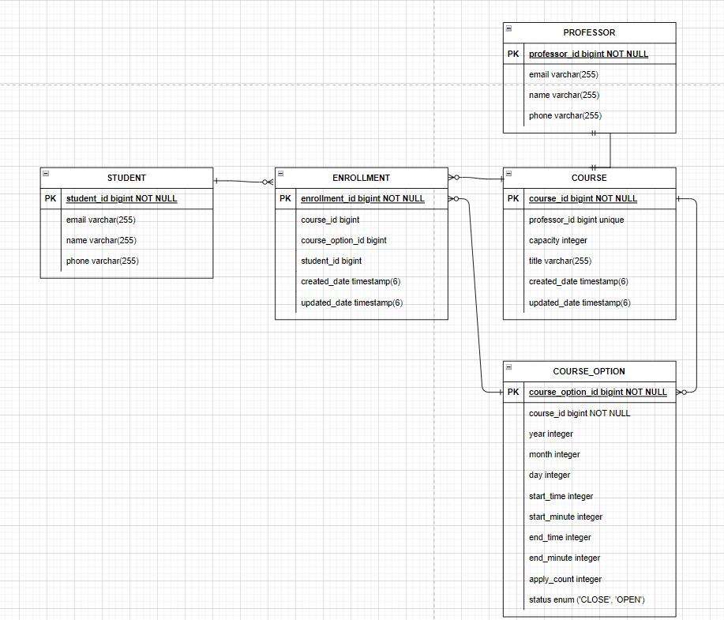

# [ 2주차 과제 ] 특강 신청 서비스

---

## 테이블 설계 ERD

---

- `STUDENT`와 `COURSE`의 N:M 구조

한 명의 신청자는 여러 개의 특강을 신청할 수 있으며, 하나의 특강은 여러 신청자를 받을 수 있습니다. 따라서 `STUDENT`와 `COURSE`는
N:M 구조이므로 신청 내역을 관리하는 `ENROLLMENT` 테이블을 기준으로 1:N, M:1 분리하였습니다.

- `ENROLLMENT`와 `COURSE_OPTION`의 1:N 구조

`COURSE`와 마찬가지로 특강 목록은 여러 개의 신청 목록을 가질 수 있습니다. `ENROLLMENT`는 총 3개의 다른 테이블의 외래키를 가지게 됩니다.

- `COURSE`와 `COURSE_OPTION` 1:N 구조

초기에 `COURSE`만 있었으나, 하나의 특강이 여러 날짜와 시간을 가질 수 있음을 고려해서 `COURSE_OPTION`과 1:N으로 분리하였습니다.

- `COURSE`와 `PROFESSOR` 1:1 구조

하나의 특강은 1명의 강사를 가지도록 하여 1:1로 설계했습니다.